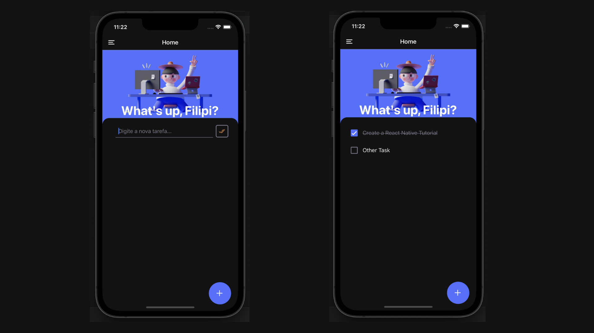

## 🚀 Sobre o Projeto
A ideia do projeto foi para aplicar, práticar e melhorar minhas habilidades técnicas em desenvolvimento mobile com React Native, Firebase e mais tecnologias que envolvendo a concepção, desenvolvimento e entrega do produto.

## 💡 Ideia
O projeto tem o objetivo final de ser um todoist mininalista com Lofi Music Player.

## 🚀 Figma
O design foi desenvolvido do zero por mim e você pode acessar em: [Figma](https://www.figma.com/file/tID5banMXZwmzG4rwFNW6Z/todo.dev?node-id=0%3A1)

## 🚀 Novas versões
Conforme vou adquirindo novas habilidades, irei atualizando o projeto em novas versões. 

## 🚀 Tecnologias utilizadas
- Javascript
- React Native
- Supabase
- Github Projects
- Expo
- Styled-Components

## 🚀 Screenshots

# Doing.dev

O projeto tem o objetivo final de ser um todoist mininalista com Lofi Music Player.

| :placard: Vitrine.Dev |     |
| -------------  | --- |
| :sparkles: Nome        | **Doing.dev Mobile**
| :label: Tecnologias | Javascript, React Native, Styled-Components, Supabase, Expo (tecnologias utilizadas)
| :rocket: URL         | https://github.com/FilipiRafael/doingdev-mobile-app
| :fire: Desafio     | https://github.com/FilipiRafael/doingdev-mobile-app

<!-- Inserir imagem com a #vitrinedev ao final do link -->

## Detalhes do projeto

A ideia do projeto foi para aplicar, práticar e melhorar minhas habilidades técnicas em desenvolvimento mobile com React Native, Supabase e mais tecnologias que envolvendo a concepção, desenvolvimento e entrega do produto.
